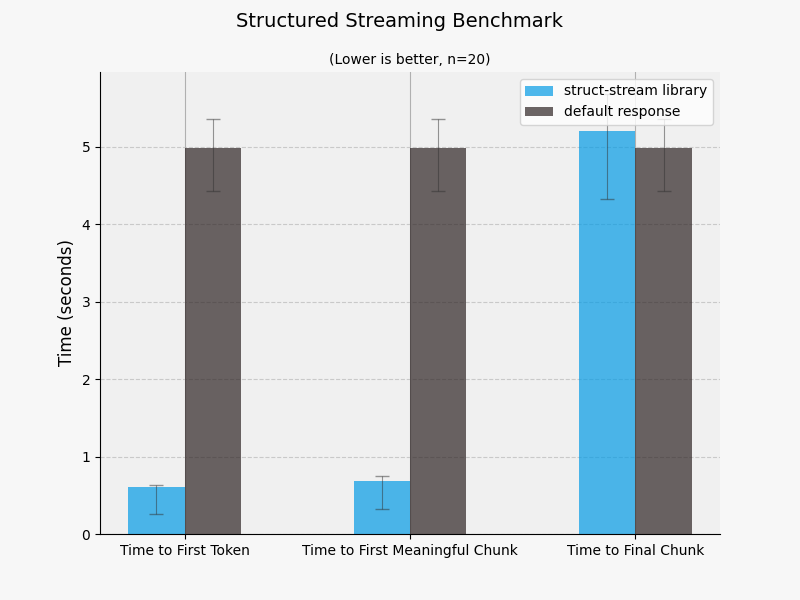

# Benchmarking

The main goal of the library is to improve more complex UI facing applications with incremental strucutred responses. The structured responses will start being returned as soon as the first keys of the structs are generated, which will be only slightly after the first tokens are returned. The benchmark is more of a sanity check to confirm this.  

The benchmark results for OpenAI are shown below. 

### Results

From the benchmark resutls we can see that we can return meaningful content to the user around 5x faster than if we waited for the whole fully parseable response. Importantly we can also start showing the user content that they can start reviewing in under a second, just like you can in a chat application.   

The respones produced a similar number tokens over the testing, which was around 1,400 characters (not tokens). This is roughly around 50 tokens/second, which is inline with normal text generation, but the time to first token time is a little long at a around 500ms. There is a hit compared to unstructured text generation, but that is to be expected due to the grammar model needing to be constructed for the token masking.